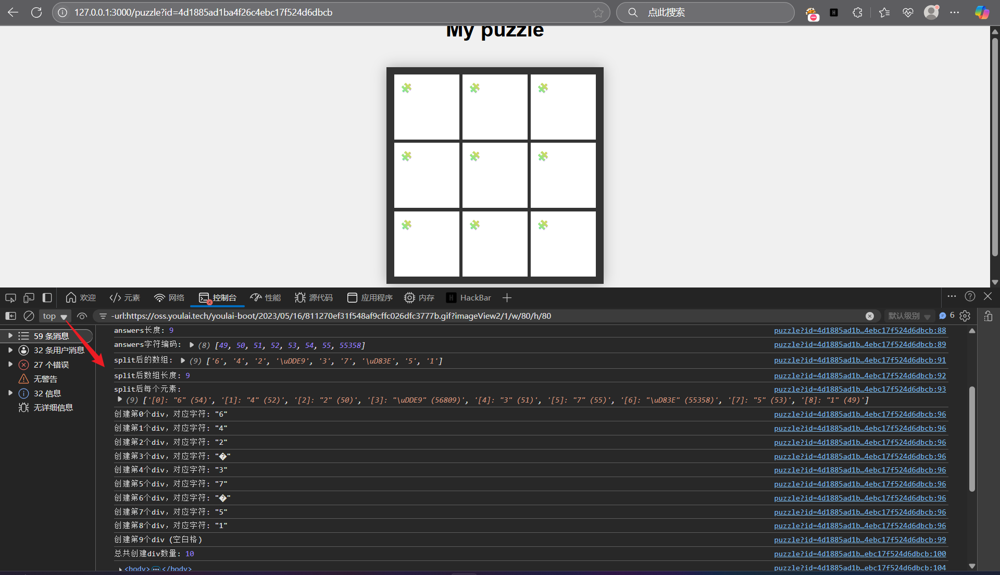
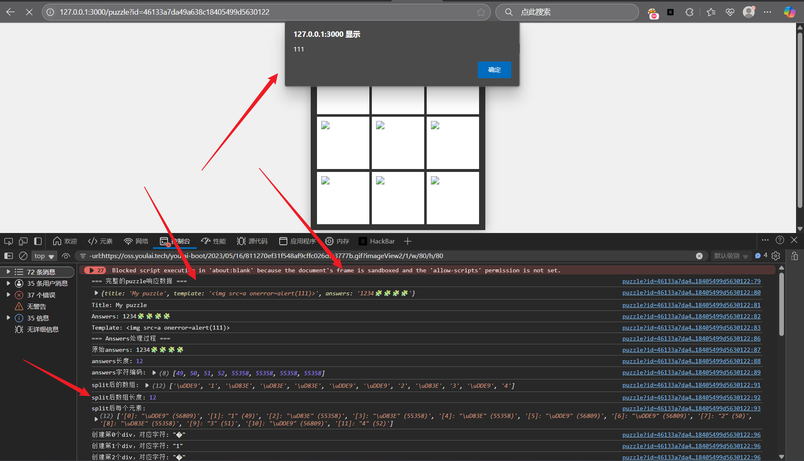

# Slide Sandbox
```
创建终极滑块拼图。
使用sandbox属性让它变得安全，对吧？
```

给出了一个生成3×3滑块拼图的网站。还存在一个bot，它会创建一个以flag为标题的滑块拼图，然后访问指定的url。这是一道XSS题目。

显示拼图的页面很重要，实现如下：

```html
<body>
  <h1 class="title" id="title"></h1><br>
  <div class="game-area">
    <div class="puzzle-container" id="puzzle">
      <iframe id="frame0" sandbox="allow-same-origin"></iframe>
      <iframe id="frame1" sandbox="allow-same-origin"></iframe>
      <iframe id="frame2" sandbox="allow-same-origin"></iframe>
      <iframe id="frame3" sandbox="allow-same-origin"></iframe>
      <iframe id="frame4" sandbox="allow-same-origin"></iframe>
      <iframe id="frame5" sandbox="allow-same-origin"></iframe>
      <iframe id="frame6" sandbox="allow-same-origin"></iframe>
      <iframe id="frame7" sandbox="allow-same-origin"></iframe>
      <iframe id="frame8" sandbox="allow-same-origin"></iframe>
    </div>
    <div class="message">
      <a href="/">TOP</a>
    </div>
  </div>
</body>

<script>
  let pieces = Array();
  fetch('/puzzles/' + (new URLSearchParams(location.search)).get('id'))
    .then(r => r.json())
    .then(puzzle => {
      document.getElementById('title').innerText = puzzle.title;

      const ans = puzzle.answers.split('').sort(() => Math.random() - 0.5); // 有时候拼图是无解的。请原谅。      
      ans.forEach((v, i) => {
        pieces.push(document.createElement("div"));
      })
      pieces.push(document.createElement("div"))

      for (var i = 0; i < frames.length; i++) {
        frames[i].addEventListener("click", slide);
        frames[i].document.body.appendChild(pieces[i]);
      }

      ans.forEach((v, i) => {
        pieces[i].innerHTML = puzzle.template.replaceAll("{{v}}", v);
      })
    });

  function slide(e) {
    // ... [省略] ...
  };
</script>
```

获取拼图数据，通过innerHTML插入到各个frame中。由于是通过innerHTML插入，并且输入可以自由控制，所以XSS看起来很容易，但是嵌入的iframe设置了`sandbox="allow-same-origin"`，所以不能正常工作。

然后发现，从插入到带sandbox的iframe中似乎不可行的角度来考虑，puzzle的answer看起来很可疑。answer是指定放置在滑块拼图中的8个字符的功能。

在服务器端的js中

```javascript
answers: { type: "string", minLength: 8, maxLength: 8 },
```

这样进行验证。在客户端

```javascript
 const ans = puzzle.answers.split('').sort(() => Math.random() - 0.5);
 ans.forEach((v, i) => {
   pieces.push(document.createElement("div"));
})
pieces.push(document.createElement("div"))

for (var i = 0; i < frames.length; i++) {
   frames[i].addEventListener("click", slide);
   frames[i].document.body.appendChild(pieces[i]);
}

ans.forEach((v, i) => {
   pieces[i].innerHTML = puzzle.template.replaceAll("{{v}}", v);
})
```

这样被split，创建个数+1个div，放入iframe中通过innerHTML进行插入。想到也许可以分割成8个以上的想法，到这里就感觉可以用Unicode来解决，试了一下，将answer设为`1234567🧩`时，可以向全部9个格子中插入字符！



这里split()后确实变成了九个数据，那么多放几个Unicode不就可以直接插入div了吗，这里只有九个iframe。

所以



这样xss就可以了，后面就是正常让bot访问拿flag
